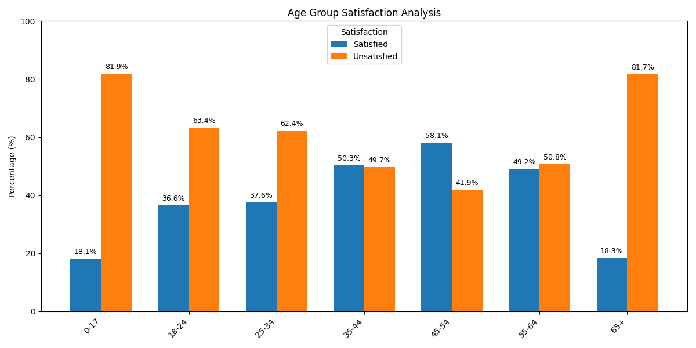
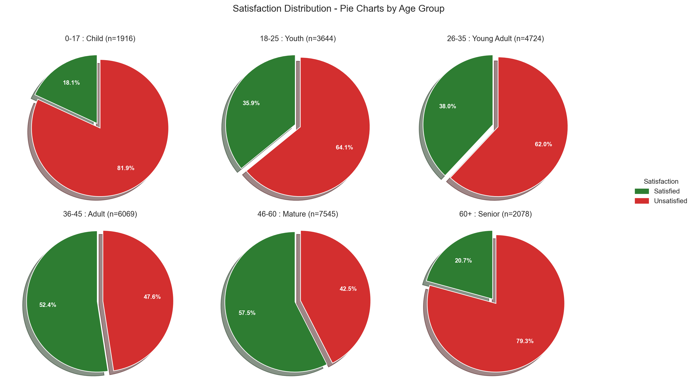
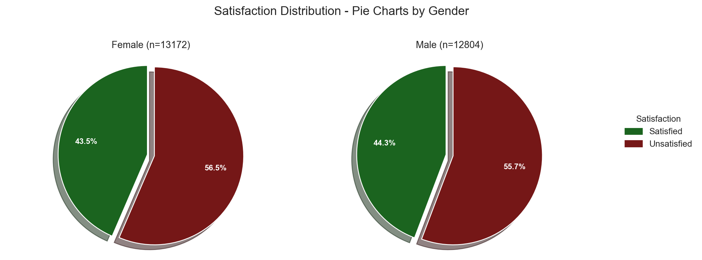
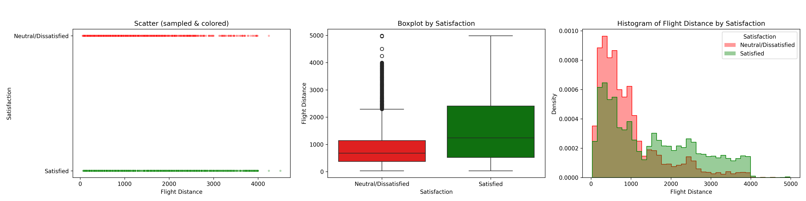

# ✈️ Airline Passenger Satisfaction Data Analysis


> A collaborative data analysis project by [@kaganmart9](https://github.com/kaganmart9) & [@ahakanortacbayram](https://github.com/ahakanortacbayram)

---

## 📌 Project Overview

This project explores **airline passenger satisfaction** using data-driven methods. The objective is to understand **how demographic and service-related factors impact customer satisfaction** in commercial air travel.

Using structured and clean code practices in Python, we preprocess, analyze, and visualize data from a real-world airline passenger dataset.

---

## 🧠 Key Questions Addressed

- How does **age** affect passenger satisfaction?
- Is there a difference in satisfaction between **genders**?
- Does **flight distance** impact satisfaction levels?
- Which **services (e.g., cleanliness, baggage, online booking)** are most correlated with satisfaction?

---

## 🗂️ Project Structure

AIRLINE-PASSENGER-SATISFACTION-DATA-ANALYSIS/
│
├── data/                        # Datasets
│   ├── raw/                     # Original dataset (raw-data.csv)
│   └── processed/               # Cleaned dataset (processed.csv)
│
├── docs/                        # Project documents (e.g., plan)
│   └── project-plan.pdf
│
├── notebooks/                  # Jupyter Notebooks for EDA & exploration
│   ├── 03-analysis-b-age-satisfaction.ipynb
│   ├── 04-analysis-b-gender-satisfaction.ipynb
│   └── flight-distance-satisfaction-scatter-analysis.ipynb
│
├── reports/                    # Final outputs
│   ├── figures/                # Visualizations (bar, pie, stacked, boxplot etc.)
│   └── tables/                 # Summary statistics (CSV)
│
├── src/                        # Modular Python scripts for reproducible analysis
│   ├── config.py               # Path and config management
│   ├── cleaning.py             # Data cleaning logic
│   ├── age_satisfaction_prc.py # Age group satisfaction analysis
│   ├── gender_satisfaction.py  # Gender-based analysis (with CLI options)
│   ├── distance_satisfaction.py # Flight distance visual analysis
│   └── service_correlation.py  # Correlation between service quality and satisfaction
│
├── requirements.txt            # Required Python packages
└── README.md                   # You are here 📄

---

## 🛠️ Setup & Installation

> 🐍 Python version: **3.11.x**

1. Clone the repository:

```bash
git clone https://github.com/kaganmart9/airline-passenger-satisfaction-data-analysis.git
cd airline-passenger-satisfaction-data-analysis
```

2. (Optional) Create a virtual environment:

```bash
python -m venv venv
source venv/bin/activate  # or venv\Scripts\activate on Windows
```

3. Install dependencies:

```bash
pip install -r requirements.txt
```

---

## 🚀 How to Run Analyses

Each script is **modular and reproducible**. You can run them independently.

### ➤ Clean the raw dataset

```bash
python src/cleaning.py
```

### ➤ Analyze satisfaction by age

```bash
python src/age_satisfaction_prc.py
```

### ➤ Analyze satisfaction by gender (CLI options available)

```bash
python src/gender_satisfaction.py --show --timestamp
```

### ➤ Analyze satisfaction vs. flight distance

```bash
python src/distance_satisfaction.py
```

### ➤ Analyze service feature correlations

```bash
python src/service_correlation.py
```

---

## 📊 Sample Visualizations

### 🎯 Satisfaction by Age Group



---

### 🧓 Age-wise Pie Charts



---

### 👨‍🦰 Gender Satisfaction Pie Charts



---

### 📏 Flight Distance Impact



---

## 📈 Output Tables

- `flight_distance_satisfaction_stats.csv`
- `gender_satisfaction_percent.csv`

All are saved under: `reports/tables/`

---

## 👥 Contributors

| Name               | GitHub Handle                              | Role                  |
|--------------------|---------------------------------------------|-----------------------|
| Kağan Mart         | [@kaganmart9](https://github.com/kaganmart9)       | Data Cleaning, Analysis & Engineering |
| Ahakan Ortaç Bayram| [@ahakanortacbayram](https://github.com/ahakanortacbayram) | Visualization, Interpretation, Modularization |

---

## 📄 License

This project is licensed under the **MIT License**. See the [LICENSE](LICENSE) file for details.

---

## 🙌 Acknowledgements

Special thanks to the open data contributors that provided the airline passenger satisfaction dataset.